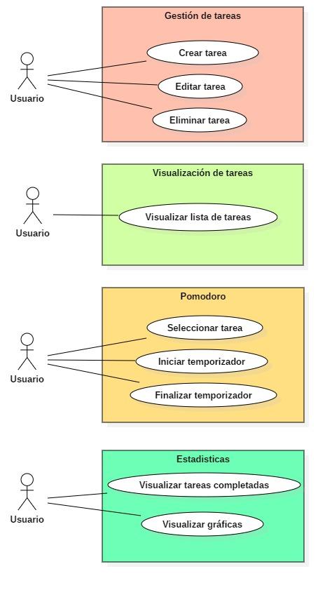
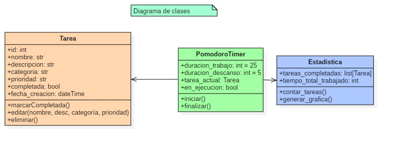

# 🎨 Diseño del Proyecto – App Tareas + Pomodoro

## 🧭 Estructura general de la interfaz

La aplicación estará dividida en 4 pestañas principales:

1. **Formulario**: permite crear, editar y eliminar tareas.
2. **Lista de tareas**: muestra todas las tareas registradas.
3. **Pomodoro**: temporizador de trabajo (25/5 minutos).
4. **Estadísticas**: muestra tareas completadas y gráficas.

**Diagramas**

`Diagrama de caso de uso`

El usuario puede interactuar con la aplicación en cuatro módulos principales:

- Gestión de tareas: crear, editar, eliminar.
- Visualización de tareas existentes.
- Control del temporizador Pomodoro.
- Revisión de estadísticas de productividad.

`Diagrama de clases`

Este diagrama representa la estructura interna de las clases en la aplicación, usando un enfoque orientado a objetos.

- `Tarea` es la entidad principal que contiene todos los atributos y métodos relacionados con una tarea.
- `PomodoroTimer` administra la lógica de tiempo y depende de una tarea activa.
- `Estadistica` se encarga de calcular y representar datos de productividad a partir de las tareas completadas.

---

## 🏗️ Arquitectura del proyecto (MVC)

La aplicación sigue el patrón Modelo–Vista–Controlador (MVC):

- `models.py` → se encarga de la lógica de datos (SQLite, clases, funciones CRUD).
- `views.py` → contiene la construcción de la interfaz gráfica con Flet.
- `controllers.py` → conecta la vista con los modelos, gestiona acciones del usuario.
- `main.py` → archivo principal que inicializa todo.

**Organización de carpetas:**
